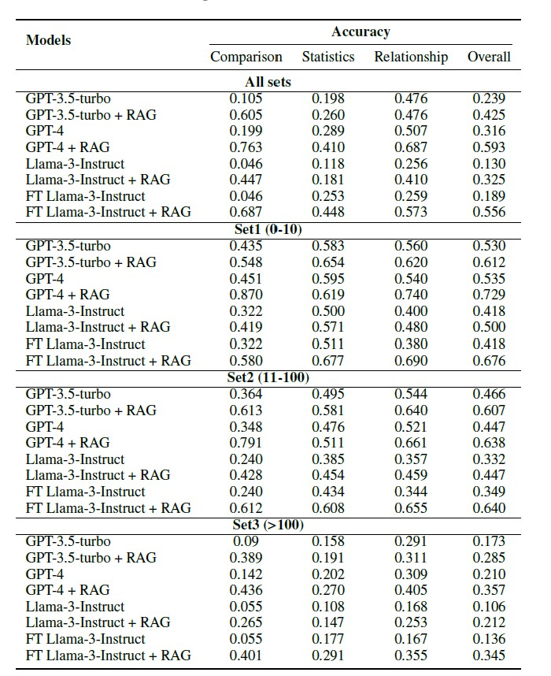

# MEBench
Data and code for paper "MEBench: Benchmarking Large Language Models for Cross-Document Multi-Entity Question Answering" (EMNLP 2025 Main)

MEBench is a scalable  multi-document, multi-entity benchmark  designed to systematically evaluate LLMs’ capacity  to retrieve, consolidate, and reason over  scattered and dense information. 

**MEBench construction pipeline**
<div align="center">
  
</div>

**Data Statistics**
<div align="center">
  
</div>

**Leaderboard**
<div align="center">
  
</div>

**Citation**
```
@inproceedings{lin-etal-2025-mebench,
    title = "{MEB}ench: Benchmarking Large Language Models for Cross-Document Multi-Entity Question Answering",
    author = "Lin, Teng  and
      Luo, Yuyu  and
      Zhang, Honglin  and
      Zhang, Jicheng  and
      Liu, Chunlin  and
      Wu, Kaishun  and
      Tang, Nan",
    editor = "Christodoulopoulos, Christos  and
      Chakraborty, Tanmoy  and
      Rose, Carolyn  and
      Peng, Violet",
    booktitle = "Proceedings of the 2025 Conference on Empirical Methods in Natural Language Processing",
    month = nov,
    year = "2025",
    address = "Suzhou, China",
    publisher = "Association for Computational Linguistics",
    url = "https://aclanthology.org/2025.emnlp-main.77/",
    pages = "1481--1494",
    ISBN = "979-8-89176-332-6",
    abstract = "Cross-Document Multi-entity question answering (MEQA) demands the integration of scattered information across documents to resolve complex queries involving entities, relationships, and contextual dependencies. Although Large Language Models (LLMs) and Retrieval-augmented Generation (RAG) systems show promise, their performance on cross-document MEQA remains underexplored due to the absence of tailored benchmarks. To address this gap, we introduce MEBench, a scalable multi-document, multi-entity benchmark designed to systematically evaluate LLMs' capacity to retrieve, consolidate, and reason over scattered and dense information. Our benchmark comprises 4,780 questions which are systematically categorized into three primary categories: Comparative Reasoning, Statistical Reasoning and Relational Reasoning, further divided into eight distinct types, ensuring broad coverage of real-world multi-entity reasoning scenarios. Our experiments on state-of-the-art LLMs reveal critical limitations: even advanced models achieve only 59{\%} accuracy on MEBench. Our benchmark emphasizes the importance of completeness and factual precision of information extraction in MEQA tasks, using Entity-Attributed F1 (EA-F1) metric for granular evaluation of entity-level correctness and attribution validity. MEBench not only highlights systemic weaknesses in current LLM frameworks but also provides a foundation for advancing robust, entity-aware QA architectures."
} 
}
```
