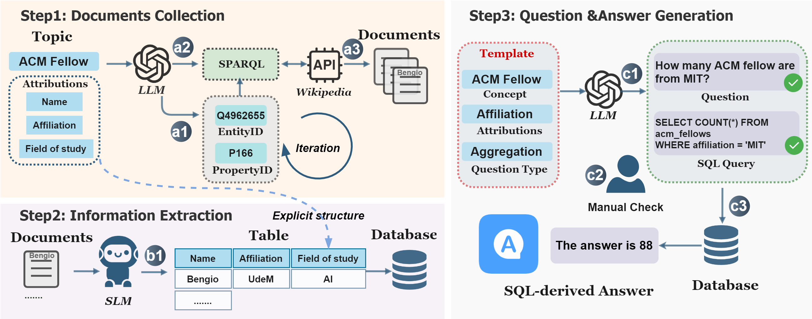
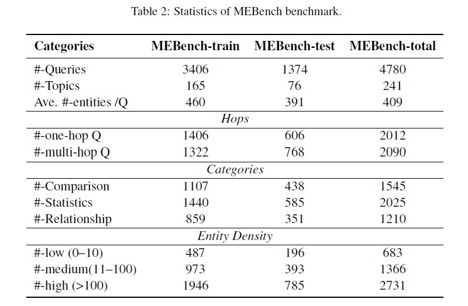

# MEBench
Data and code for paper "MEBench: Benchmarking Large Language Models for Cross-Document Multi-Entity Question Answering" (EMNLP 2025 Main)

MEBench is a scalable  multi-document, multi-entity benchmark  designed to systematically evaluate LLMs’ capacity  to retrieve, consolidate, and reason over  scattered and dense information. 

**MEBench construction pipeline**

  

**Data Statistics**

  

